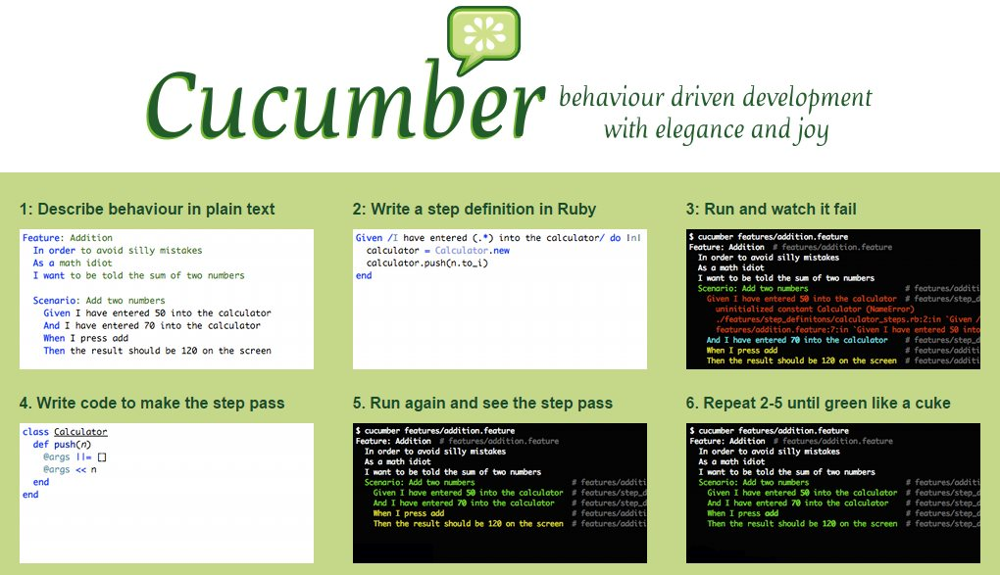

#Tutoriel de prise en main de Cucumber

*Ce tutoriel s'inspire de l'exemple Shakespeare du [Kata Cucumber/Mockito](https://github.com/CodingDojoPolytech/cucumber-mockito-shakespeare) de [Sébastien Mosser](https://twitter.com/petitroll)* 

**[Cucumber](https://cucumber.io/)** est un framework de tests pour le **B**ehavior **D**riven **D**evelopment, initialement développé en Ruby, mais proposant aujourd'hui des [implémentations possibles pour de nombreux autres langages de programmation](https://cucumber.io/docs#cucumber-implementations). Le site de référence est : **[cucumber.io](https://cucumber.io)**.

Dans l'écosystème Java, [Cucumber](https://cucumber.io/) est aujourd'hui un des frameworks BDD les plus utilisés.


Comme tout framework adapté au BDD, [Cucumber](https://cucumber.io/) permet de transformer les scénarii d'une story (écrits sous forme d'exemples en *langage naturel* au format *Gherkin*) en tests java automatisés. Dans le principe, cette transformation est possible à l'aide du framework de tests [JUnit](http://junit.org/). Chaque **étape d'un scénario** est implémentée comme une **méthode java, appelée step**. Le lien entre la description textuelle de l'étape et le code Java de la step est réalisé via des annotations.

Dans ce tutoriel, nous verrons comment :

* [Installer le plug-in Cucumber-Eclipse](#plugInCucumberEclipse)
* [Mettre en place votre premier projet Cucumber](#mettrePlaceProjetCucumber)
	* [1. Créer un projet Maven](#creerProjetMaven)
	* [2. Configurer le `pom.xml` pour Cucumber](#configurerPom)
	* [3. Décrire le comportement en langage naturel (`.feature`)](#comportementLangageNaturel)
	* [4. Configurer le lanceur de tests](#configurerLanceurDeTests)
	* [5. Implémenter le code de test des *steps* (méthodes java)](#implementerStepsJava)
	* [6. Implémenter le code métier de l'application](#implementerCodeMetier)  
	
Mais aussi, comment :

* [Paramétrer les steps à l'aide d'expressions régulières](#parametrerStepsRegEx) 
* [Alléger la lecture d'un scénarios (`And` et `But`)](#allegerLectureScenario)
* [Paramétrer un scénario](#parametrerScenario)
* [Factoriser des scénarios](#factoriserScenario)
* [Paramétrer le lanceur de test à partir de `@CucumberOptions`](#CucumberOptions)
* [Produire un *beau* rapport à l'aide du plug-in `cucumber-reporting`](#CucumberReporting)
* [Remarques complémentaires](#remarquesComplementaires)
<!-- * Vers une documentation vivante à l'aide de CukeDoctor : à venir ... -->


## Installer le plug-in Cucumber-Eclipse <a id="plugInCucumberEclipse"></a>

**[Cucumber-Eclipse](https://github.com/cucumber/cucumber-eclipse)** est un plugin Eclipse qui permet d'écrire et d'exécuter les scénarii Cucumber directement dans l'IDE facilitant ainsi leur automatisation.  
La documentation en ligne de ce plug-in est disponible sur : [https://github.com/cucumber/cucumber-eclipse](https://github.com/cucumber/cucumber-eclipse). 
Comme nous le verrons un peu plus loin, ce plug-in propose entre autres [une coloration syntaxique](https://github.com/cucumber/cucumber-eclipse/wiki/I18n-Syntax-highlighting), [une assistance lors de l'écriture des scénarii](https://github.com/cucumber/cucumber-eclipse/wiki/Content-Assistance-for-feature-file),et quelques autres fonctionnalités consultables sur ce [wiki](https://github.com/cucumber/cucumber-eclipse/wiki).
<!-- une détection de lien hypertexte d'une étape textuelle vers la méthode Java correspondante, une autocomplétion, une validation des étapes. -->

Pour installer ce plug-in dans Eclipse, utiliser le menu **Help → Install New Software...** et indiquer l'adresse du site suivante : [https://cucumber.io/cucumber-eclipse//update-site](https://cucumber.io/cucumber-eclipse//update-site)

Redémarrer Eclipse.


##  Mettre en place votre premier projet Cucumber <a id="mettrePlaceProjetCucumber"></a>


### 1. Créer un projet Maven <a id="creerProjetMaven"></a>

[Créer un projet maven](https://github.com/iblasquez/Back2Basics_Developpement/blob/master/CreerProjetMavenEclipse.md) que vous appelerez, par exemple,`cucumber_demo`.


### 2. Configurer le `pom.xml` pour Cucumber <a id="configurerPom"></a>

Mettre à jour votre `pom.xml` avec les trois dépendances suivantes :  

- la première pour pouvoir utiliser Cucumber. Nous avons choisi une dépendance classique : `cucumber-java` (pas d'utilisation de lambda dans ce tutoriel) comme indiqué dans [la documentation Cucumber de référence spécifique à l'implémentation Java](https://cucumber.io/docs/reference/jvm#java).
- les deux dépendances suivantes `cucumber-junit` et `junit` pour pouvoir exécuter les scénarii Cucumber dans **JUnit** à l'aide du **JUnit Runner**. Chaque étape de scénario, considérée alors comme un test spécifique, pourra ainsi être directement visualisée dans la vue JUnit de l'IDE.

```XML

	<dependencies>
		<dependency>
			<groupId>info.cukes</groupId>
			<artifactId>cucumber-java</artifactId>
			<version>1.2.4</version>
			<scope>test</scope>
		</dependency>

		<dependency>
			<groupId>info.cukes</groupId>
			<artifactId>cucumber-junit</artifactId>
			<version>1.2.4</version>
			<scope>test</scope>
		</dependency>

		<dependency>
			<groupId>junit</groupId>
			<artifactId>junit</artifactId>
			<version>4.12</version>
			<scope>test</scope>
		</dependency>
	</dependencies>

```

Une fois, le `pom.xml` modifié, n'oubliez pas de relancer `Maven -> Update Project...`


### 3. Décrire le comportement en langage naturel (`.feature` dans `src/test/resources`) <a id="comportementLangageNaturel"></a>

Créer un nouveau `Source Folder` que vous appelerez `src/test/resources`.    
Créer un fichier `cocktail.feature` dans un package `dojo` de `src/test/resources`.

Le plug-in Cucumber-Eclipse reconnait l'extension `.feature` et vous remplit automatiquement ce fichier en vous montrant différentes manières d'écrire un scénario.    
Effacer le contenu de ce fichier, ne garder que la première ligne dans laquelle vous pouvez ajouter vos noms et prénoms comme par exemple **`#Author: Isabelle BLASQUEZ`**

Recopier ensuite dans ce fichier le récit de la story suivante et enregister le :

```GHERKIN

Feature: Cocktail Ordering

  As Romeo, I want to offer a drink to Juliette so that we can discuss together (and maybe more).
  
  Scenario: Creating an empty order  
  Given Romeo who wants to buy a drink  
  When  an order is declared for Juliette  
  Then  there is no cocktail in the order  

```

Dans **Cucumber**, une **story** est composée de *scénarii* et chaque **scénario** est composé d' **étapes**. La story est (d)écrite en Gherkin dans un fichier `.feature` dans lequel on trouve:

* le **titre** de la story introduit par le mot clé **`Feature`** :   
`Feature: <Titre de la fonctionnalité>`

* Un **descriptif (optionnel)** (qui ne sera pas interprété par Cucumber) permettant par exemple, de résumer la story à l'aide du template `As..., I want to..., so that ....`
et/ou de noter toutes autres informations utiles à connaître.  

* les **scénarii** de la story :
	- Chaque scénario est introduit par le mot clé **`Scenario`**. Ce mot clé peut être suivi ou non d'un titre qui décrit explicitement le critère d'acceptance de la story associé à ce scénario.  

	- Un scénario étant un exemple concret qui illustre une règle métier, il est composé de plusieurs **étapes**. Les différentes étapes d'un scénario sont décrites à partir des 3 principaux mots clés : **`Given`**, **`When`** et **`Then`** suivant la place et le rôle qu'elles occupent dans le scénario :  
			- `Given` décrit les conditions initiales du scénario, c-a-d le contexte dans lequel va se dérouler le scénario.  
			- `When` décrit une action effectuée par un utilisateur, c-a-d un événement qui va réellement déclencher le scénario.  
			- `Then` décrit le comportement attendu, ce qui devrait se produire lorsque les conditions initiales sont remplies et l'action est effectuée.  
	Pour en savoir plus, le [wiki de Cucumber](https://github.com/cucumber/cucumber/wiki) propose deux rubriques **Given-When-Then** consultables [ici](https://github.com/cucumber/cucumber/wiki/Given-When-Then-(new)) et [là](https://github.com/cucumber/cucumber/wiki/Given-When-Then).


Cucumber propose quelques mots clés supplémentaires comme `Background` , `And` , `But`, `Scenario Outline` et `Examples` que nous verrons un peu plus loin.  

*Remarque:* Une présentation complète de la grammaire utilisée par Cucumber est consultable dans la rubrique [Gherkin](https://cucumber.io/docs/reference#gherkin) du manuel de référence [ici]((https://cucumber.io/docs/reference#gherkin).


### 4. Configurer le lanceur de tests (dans `src/test/java`) <a id="configurerLanceurDeTests"></a>

Le lanceur  de tests permet de configurer l'environnement de tests des scénarii.  

#### 4.1 Création d'un fichier `RunCucumberTest.java` dans un package `dojo` de `src/test/java`

Implémenter ce fichier de manière à ce qu'il devienne le lanceur des tests Cucumber :

```JAVA  
package dojo;  

import cucumber.api.junit.Cucumber;  
import org.junit.runner.RunWith;  

@RunWith(Cucumber.class)  
public class RunCucumberTest { }    
```

L'annotation `@RunWith(Cucumber.class)` permet d'exécuter les scénarios Cucumber dans **JUnit** à l'aide du **JUnit Runner**.

*Remarque :* Pour l'instant, la configuration du lanceur de tests est minimale.  
La configuration peut être personnalisée via des options de configuration prédéfinies et consultables dans la [rubrique Running Cucumber du manuel de référence](https://cucumber.io/docs/reference/jvm#running-cucumber). Ces options seront transmises via l'annotation `@CucumberOptions` : nous ajouterons certaines options par la suite.

#### 4.2 Exécution du lanceur de tests (`RunCucumberTest.java`)

Pour exécuter les scénarii du fichier `.feature`, il suffit désormais d'exécuter le lanceur de tests `RunCucumberTest` comme un simple fichier **`JUnit`** via la commande habituelle (`Run As -> JUnit Test`).

Il ne vous reste donc plus qu'à **lancer vos scénarii et consulter la console.**

Le lanceur de tests fait le mapping entre les **étapes** des scénarii écrites de manière naturelle (fichier `.feature`) et les méthodes Java implémentant ces étapes. Les étapes Java sont appelées des **steps** et sont définies grâce à des annotations spécifiques: **`@Given`** , **`@When`** ,**`@Then`**. 
 
A ce point du tutoriel, le fichier contenant les **steps** n'existe pas encore.   
C'est pourquoi, le rapport de tests dans la console propose, pour chaque étape du fichier `.feature`, un squelette de **step** (annoté et paramétré) qu'il ne reste plus qu'à implémenter pour réaliser le mapping entre les scénariis Cucumber et le code métier java. 


### 5. Implémenter le code de test des *steps* (méthodes java) (dans `src/test/java`) <a id="implementerStepsJava"></a>

Créer un fichier `CocktailSteps.java` dans un package `dojo` de `src/test/java`.  


#### 5.1 Le *squelette* des steps issu du rapport de tests de la console

Implémenter ce fichier de **steps** en **copiant/collant le rapport de tests fourni par la console** (moins fastidieux et plus sûr que décrire le mapping *à la main* : vous avez sans doute remarqué les caractères spéciaux tels que `^` ou `$` dans les annotations `@Given`, `@When`, `@Then`)
     
**Ajouter ensuite les `import`** nécessaires à une bonne compilation afin d'obtenir un code similaire au suivant :


```JAVA  

package dojo;  

import cucumber.api.PendingException;  
import cucumber.api.java.en.Given;  
import cucumber.api.java.en.Then;  
import cucumber.api.java.en.When;  

public class CocktailSteps {

	@Given("^Romeo who wants to buy a drink$")
	public void romeo_who_wants_to_buy_a_drink() throws Throwable {
		// Write code here that turns the phrase above into concrete actions
		throw new PendingException();
	}

	@When("^an order is declared for Juliette$")
	public void an_order_is_declared_for_Juliette() throws Throwable {
		// Write code here that turns the phrase above into concrete actions
		throw new PendingException();
	}

	@Then("^there is no cocktail in the order$")
	public void there_is_no_cocktail_in_the_order() throws Throwable {
		// Write code here that turns the phrase above into concrete actions
		throw new PendingException();
	}
	
}

```

Chaque **step** commence par une annotation spécifique: `@Given` ou, `@When` ou `@Then`.

Pour que le mapping existe entre la **step** (`.java`) et l'**étape** d'un scénario (`.feature`) la **valeur de l'annotation java** doit contenir la **phrase décrivant l'étape du scénario** à quelques caractères spéciaux près.  
Pour plus de renseignements, consultez la rubrique [**Step Definitions** du manuel de reférence](https://cucumber.io/docs/reference#step-definitions)

#### 5.2 La configuration du lanceur de tests pour une *step dite PENDING* (option `strict`)

Pour l'instant chaque ***step*** lance juste une `PendingException`.  
On dit qu'une ***step*** est **PENDING** lorsque le mapping entre le langage naturel et le code n'a pas encore été réalisé.

**Exécuter le lanceur de tests et consulter la vue JUnit.** 
Vous remarquerez que tous les tests passent au vert, et que la console indique la présence de `cucumber.api.PendingException` ce qui signifie qu'une implémentation des steps est attendue.

Il est possible de faire en sorte que les tests soient au rouge lorsque une(des) step(s) reste(nt) à implémenter. Pour cela il est nécessaire de configurer le lanceur de test `RunCucumberTest` à l'aide de l'annotation `@CucumberOptions` et de l'option `strict` à `true`.

**Ajouter l'annotation `@CucumberOptions(strict = true)`** à la classe `RunCucumberTest` :


```JAVA 

    @RunWith(Cucumber.class) 
    @CucumberOptions(strict = true) 
    public class RunCucumberTest { }
```

Exécuter le lanceur de test.  
Cette fois-ci, une barre rouge apparaît car le premier test est en échec (la ***step*** n'a pas encoré été implémentée).


#### 5.3 L'implémentation des steps en Java pour produire le comportement attendu

Il est maintenant nécessaire d'implémenter chaque step de manière à ce qu'elle produise le comportement attendu du scénario et puisse ainsi être exécutée en Java.

##### Zoom sur la première step Java
Par exemple, la première étape du scénario : `Given Romeo who wants to buy a drink` devient exécutable en Java, dès lors qu'on lui associe le code suivant qui est une traduction possible de manière algorithmique du comportement attendu : 

```JAVA  
   
public class CocktailSteps {

	private Order order;
	
	@Given("^Romeo who wants to buy a drink$")
	public void romeo_who_wants_to_buy_a_drink() throws Throwable {
		 order = new Order();
	     order.declareOwner("Romeo");
	}

	//...
}
```

**Remarque :** Ceci est une *proposition* pour rendre l'étape `Given Romeo who wants to buy a drink` exécutable, donc une proposition de conception pour notre application de cocktails. 
On dit que *le développement est ici dirigé par le comportement (Behavior Driven Developement), dans le où le comportement de la story (via les différentes étapes de son scénario) permet de faire émerger une API publique pour l'application.*.

Cette première step a ainsi permis de faire apparaître une classe **`Order`** et sa méthode **declareOwner`** (qu'il ne restera plus qu'à implémenter pour faire passer la *step* au vert...)


##### Une implémentation possible pour la deuxième step :

```JAVA  

    public class CocktailSteps {

	    //...
   
       @When("^an order is declared for Juliette$")  
       public void an_order_is_declared_for_juliette() {  
          order.declareTarget("Juliette");  
       } 

	  //... 
}  
```

##### Une implémentation possible pour la troisème step :

```JAVA  

    import static org.junit.Assert.*;
    import java.util.List;

    public class CocktailSteps {

	    //...

	    @Then("^there is no cocktail in the order$")
	    public void there_is_no_cocktail_in_the_order() throws Throwable {
		    List<String> cocktails =  order.getCocktails();
            assertEquals(0, cocktails.size());
	    }
   }

```  

Implémenter les trois steps avec le code proposé précédemment.

Supprimer les erreurs de compilation en vous aidant de votre IDE, pour créer automatiquement (en gardant pour l'instant l'implémentation vide par défaut proposée par l'IDE):

* une classe `Order`dans lz package `dojo` de `src/main/java`
* et ses méthodes : `declareOwner`, `declareTarget` et `getCocktails` 


Le scénario Gherkin du fichier `.feature` est désormais transformé en code java exécutable.  
L' `assertEquals` de la step `@Then` montre bien que ce scénario est en fait transformé en un test appelé **test d'acceptance** (puisqu'on se situe au niveau de la story donc des exigences du client).

Exécuter le scénario via `RunCucumberTest` revient à exécuter ce test.

Essayer d'exécuter le fichier `RunCucumberTest` pour voir ce qui se passe.
Que constatez-vous ? 
La step `@Then` échoue : c'est normal car pour le moment nous n'avons rien implémenté...


### 6. Implémenter le code métier de l'application <a id="implementerCodeMetier"></a>


L'idéal dans un développement agile est bien sûr d'implémenter le code métier en TDD.  
 
Pour ce tutoriel, contentez-vous de recopier l'implémentation suivante pour votre classe `Order` :


```JAVA 

    package dojo;

    import java.util.ArrayList;
    import java.util.List;

    public class Order {

        private String from;
        private String to;
        private List<String> contents = new ArrayList<String>();

        public void declareOwner(String romeo) {
            this.from = romeo ;
        }

        public void declareTarget(String juliette) {
            this.to = juliette ;
        }

       public List<String> getCocktails() {
            return contents;
        }
    }

```

Exécuter le fichier `RunCucumberTest`. Que constatez-vous ?   
La step `@Then` est *au vert* : le `Scenario: Creating an empty order` est exécuté par le programme java avec succès.   
Ce scénario est donc devenu une **spécification exécutable**, puisque exécuter ce scénario revient maintenant à tester automatiquement (et donc à exécuter) le code métier.


**En résumé** : La mise en place de votre premier projet Cucumber s'est faite en plusieurs étapes reprises visuellement sur la figure suivante (anciennement disponible sur le site [cukes.info](http://cukes.info/) devenu depuis [cucumber.io](https://cucumber.io/))



Ainsi, outre [créer un projet Maven](#creerProjetMaven) et [configurer le `pom.xml` pour Cucumber](#configurerPom), la mise en place de tests fonctionnels automatisés a nécessité :   
1. de [décrire le comportement en langage naturel (`.feature`)](#ComportementLangageNaturel)  
2. d'[implémenter le code de test des *steps* (méthodes java)](#ImplementerStepsJava)  
4. d'[implémenter le code métier de l'application](#ImplementerCodeMetier)  
3. et 5. d'exécuter les tests jusqu'à ce qu'ils passent au VERT !   
sans oublier bien sûr de [configurer le lanceur de tests (`RunCucumberTest.java`) ](#configurerLanceurDeTests)


## Paramétrer les steps à l'aide d'expressions régulières <a id="parametrerStepsRegEx"></a>

Pour l'instant, notre scénario met uniquement en scène *Roméo* et *Juliette*.
Mais ne pourrait-on pas immaginé un nouveau scénario (nouvel exemple) où *Tom*  souhaiterait prendre un verre avec *Jerry* ?   

```GHERKIN 

 Scenario: Creating another new empty order  
  Given Tom who wants to buy a drink  
  When  an order is declared for Jerry  
  Then  there is no cocktail in the order 

```

***On ne vous demande pas d'écrire ce scénario pour le moment, juste d'en prendre connaissance*** et de constater que ce scénario reprend les étapes du scénario précédent à deux paramètres près : *Tom* et *Jerry* au lieu de *Roméo* et *Juliette*. Il soulève ainsi la question de se savoir comment paramétriser les steps`@Given`, `@When` et `@Then` dans le code java afin d'éviter la duplication de code...

Cucumber permet cela en proposant l'utilisation d'expressions régulières (regex) dans les steps Java pour matcher (détecter) un motif dans la description textuelle d'une étape.  Par exemple :  
- l'expression **`(.*)`** permettra de matcher un **string**  
- l'expression **`(\\d+)`** permettra de matcher un **entier**


**Remarques :** 

* Un exemple d'expression régulière concernant les entiers est d'ailleurs donné dans [la partie Steps Definitions du manuel de référence Cucumber](https://cucumber.io/docs/reference#step-definitions) (veillez bien à choisir le langage java qui devrait vous afficher : `@Given("I have (\\d+) cukes in my belly`.)  
* Besoin d'un petit rappel sur les regex ? :  
  - une liste des expressions régulières Cucumber peut être consultée [ici](http://agileforall.com/wp-content/uploads/2011/08/Cucumber-Regular-Expressions-Cheat-Sheet.pdf).  
  - une liste des expressions régulières avec l'API Regex de Java peut être consultée [ici](http://cyberzoide.developpez.com/tutoriels/java/regex/).


Pour la suite du tutoriel, nous allons donc commencer par refactorer le code existant du scénario *Roméo* et *Juliette* en le paramétrant avant d'ajouter un nouveau sécanrio...

### 1. Paramétrer les steps Java

#### Paramétrer la step `@Given`
Pour paramétrer le nom de la personne qui veut prendre un verre il faut donc dans le code Java :  
- ajouter l'expression **`(.*)`** dans l'annotation `Given`.   
- ajouter un paramètre de type `String romeo` dans la signature de la méthode.  
- passer `romeo` en paramètre `romeo` de la méthode `declareOwner`.

Le code de la nouvelle step `@Given` devient donc :

```JAVA

    @Given("^(.*) who wants to buy a drink$")  
	public void romeo_who_wants_to_buy_a_drink(String romeo) throws Throwable {  
		 order = new Order();  
	     order.declareOwner(romeo);  
	}  
```

Modifier le code de la step `@Given` et exécuter `RunCucumberTest` afin de s'assurer que les tests passent toujours au vert !

#### Paramétrer la step `@When`
Paramétrer cette step revient à paramétrer le nom de la personne pour qui on commande un verre.  
Paramétrer la step `@When` revient à écrire le code suivant :

```JAVA

	@When("^an order is declared for (.*)$")  
	public void an_order_is_declared_for_Juliette(String juliette) throws Throwable {  
		// Write code here that turns the phrase above into concrete actions  
		order.declareTarget(juliette);  
	}  
```

Modifier le code de la step `@When` et exécuter `RunCucumberTest` afin de s'assurer que les tests passent toujours au vert !

#### Paramétrer la step `@Then`
Paramétrer cette step revient à paramétrer le nombre de cocktail dans la commande.  
En l'état actuel, il faut refactorer à deux niveaux : 

* **dans l'étape textuelle du scénario** : commencer par remplacer le `no` par `0` et rajouter un `s` à `cocktails` (en prévision de la réutilisabilité de cette étape par la suite) de manière à obtenir : **`Then  there is 0 cocktails in the order`**

* **dans la step `@Then`** : paramétrer le nombre de cocktails comme un entier grâce à l'expression **`(\\d+)`** (et **ne pas oublier de rajouter des `s` à `cocktails`**) de manière à obtenir :
 
```JAVA  

	@Then("^there is (\\d+) cocktails in the order$")
	public void there_is_nb_cocktails_in_the_order(int nbCocktails) throws Throwable {
		List<String> cocktails =  order.getCocktails();
        assertEquals(nbCocktails, cocktails.size());
	}  
```

Modifier le texte de l'étape `Then` et le code de la step `@Then` et exécuter `RunCucumberTest` afin de s'assurer que les tests passent toujours au vert !


### 2. Ecriture d'un nouveau scénario à l'aide du plug-in Cucumber-Eclipse

Le plug-in Cucumber-Eclipse propose via **`Ctrl+Espace`** une auto-complétion dans l'éditeur de scénarios (pour les `.feature`). La documentation peut être consultée [ici](https://github.com/cucumber/cucumber-eclipse/wiki/Content-Assistance-for-feature-file) et nous allons maintenant tester cette auto-complétion en ajoutant un nouveau scénario au fichier `cocktails.feature`.

Placer-vous en fin de fichier `cocktails.feature` sur une nouvelle ligne vide.
Un appel à `Ctrl+Espace` propose une liste de mots clés utilisables à cet emplacement.  
Choisir **`Scenario`** et compléter la ligne par l'intitulé du scénario, par exemple 
**`Scenario : Creating another new empty order`**.  

Cette fois-ci l'exemple de ce nouveau scénario concernera **Tom** et **Jerry**.

#### 2.1 Première étape du scénario (Given)
Passer à la ligne suivante pour écrire la première étape du scénario.  

* Un premier `Ctrl+Espace` permet de sélectionner le mot clé **`Given`**.
* Appuyez sur espace
* Un second `Ctrl+Espace` affiche les steps déjà écrites dans le fichier java. Choisir la première `(*) who wants to buy a drink` et remplacer le `(.*)` par `Tom` de manière à obtenir comme première étape de ce nouveau scénario : **` Given Tom who wants to buy a drink `**

#### 2.2 Deuxième étape du scénario (When)
Passer à la ligne suivante pour écrire la deuxième étape du scénario.  
De la même manière, en vous aidant de l'auto-complétion, écrire : **`When an order is declared for Jerry`** 

#### 2.3 Troisième étape du scénario (Then)
Passer à la ligne suivante pour écrire la troisième étape du scénario : **`Then there is 0 cocktails in the order`** 

Pour indenter correctement le fichier `.feature`, faire un clic droit et choisir le menu **Pretty Format**.

Ne pas oublier d'enregistrer ce fichier !


### 3. Exécution du nouveau scénario

Comme nous avons utilisé des steps (paramétrées) déjà implémentées dans le fichier `CocktailSteps.java`, il est impossible de passer directement à l'exécution de ce nouveau scénario.   

Exécuter le fichier `RunCucumberTest`.
La vue JUnit vous indique maintenant que les deux scénarios passent bien au vert !


## Alléger la lecture d'un scénario (`And` et `But`) <a id="allerLectureScenario"></a>

Nous allons maintenant ajouter un nouveau scénario dans `cocktails.feature`.  
Pour envoyer un message (de mots doux ?) à la cible en même temps que la commande est demandée, il serait possible d'écrire le scénario suivant (et ça marcherait !) :

```GHERKIN

 Scenario: Sending a message with an order    
  Given Romeo who wants to buy a drink  
  When  an order is declared for Juliette  
  When  a message saying "Wanna chat?" is added   
  Then the ticket must say "From Romeo to Juliette: Wanna chat?"

```

En fait, pour alléger la lecture du scénario, le [Gherkin](https://cucumber.io/docs/reference#gherkin) propose deux autres mots clés `And` et `But` qui permettent juste de mettre de l'emphase dans le texte. Ces deux mots clés n'auront aucun effet au niveau de l'implémentation du scénario, puisqu'ils reprennent juste le mot-clé précédent.

Nous préférons donc écrire dans `cocktails.feature` le scénario suivant (avec le mot clé `And`) :

```GHERKIN

 Scenario: Sending a message with an order    
  Given Romeo who wants to buy a drink  
  When  an order is declared for Juliette  
  And  a message saying "Wanna chat?" is added   
  Then the ticket must say "From Romeo to Juliette: Wanna chat?"

```

Enregistrer et exécuter `RunCucumberTest.java`.  

Consulter la console, deux nouvelles steps sont proposées :  
- une avec l'annotation `@Then`   
- et l'autre avec l'annotation `@When` (qui correspond bien à notre étape de scénario commençant par un `And` précédé par `When`).

Récuperer dans la console le squelette d'implémentation de ces nouvelles steps que vous copier/coller les dans le fichier `CocktailSteps.java` afin de procéder à leur implémentation qui pourrait être par exemple :

```JAVA

	@When("^a message saying \"([^\"]*)\" is added$")
	public void a_message_saying_is_added(String something) throws Throwable {
		order.withMessage(something);
	}

	@Then("^the ticket must say \"([^\"]*)\"$")
	public void the_ticket_must_say(String somethingElse) throws Throwable {
		assertEquals(somethingElse, order.getTicketMessage());
	}

```

Il ne reste plus qu'à procéder à l'implémentation du code métier dans la classe `Order` des méthodes `withMessage` et `getTicketMessage`

``` JAVA

    public class Order {

	    //...
	    private String message;

	    //...

	    public void withMessage(String something) {
		    this.message = something;
	    }

	    public String getTicketMessage() {
		    return "From " + from + " to " + to + ": " + message;
	    }

    }
```

Relancer `RunCucumberTest.java` et constater que tous les scénarios passent au vert !


Récapitulons, le mot clé **`And`** permet d'ajouter une étape supplémentaire au scénario pour alléger sa lecture. Ce mot clé ne peut se trouver qu'après un des trois mots clés de base *`Given`*, *`When`*, ou *`Then`* ou après un autre `And`. Il peut y avoir autant de `And` que le nécessite la description. Il en est de même pour le mot clé `But`.


## Paramétrer un scénario <a id="parametrerScenario"></a>


### Un premier scénario paramétré ...
Reprenez l'ensemble des scénarios du fichier `cocktail.feature` :

```GHERKIN

  Scenario: Creating an empty order  
    Given Romeo who wants to buy a drink  
    When an order is declared for Juliette  
    Then there is 0 cocktails in the order  

  Scenario: Creating another new empty order  
    Given Tom who wants to buy a drink  
    When an order is declared for Jerry  
    Then there is 0 cocktails in the order  

  Scenario: Sending a message with an order  
    Given Romeo who wants to buy a drink  
    When an order is declared for Juliette  
    And a message saying "Wanna chat?" is added  
    Then the ticket must say "From Romeo to Juliette: Wanna chat?"  
```

La lecture des deux premiers scénarios montrent une duplication dans le descriptif des étapes. 
Il est possible de factoriser ces descriptions et de les regrouper au sein d'un même scénario dit **paramétré** grâce au mot clé  **`Examples`** pour en faciliter la lecture.

Remplacer les deux premiers scénarios par le **scénario paramétré** suivant et indenter correctement le fichier `.feature` (via un clic droit et le menu **Pretty Format**) :

```GHERKIN

    Scenario Outline: Creating an empty order  
     Given <from> who wants to buy a drink  
     When an order is declared for <to>  
     Then there is <nbCocktails> cocktails in the order  

     Examples: 
       | from  | to       | nbCocktails |
       | Romeo | Juliette |           0 |
       | Tom   | Jerry    |           0 |
```

Le **scénario paramétré** commence par le mot clé **`Scenario Outline`**.  
Il est rédigé comme un scénario classique avec, dans les étapes, des ***paramètres*** notés entre **`<`** et **`>`** : c'est une sorte de *template* de scénario.  
  
Lors de l'exécution, les *paramètres* seront remplacées par les valeurs présentes dans les lignes de la table introduite par le mot clé **`Examples`**.    
**Lors de l'exécution, il y aura donc autant de scénarios exécutées que d'exemples (lignes valuées) présents dans la table `Examples`**. 


Exécuter `RunCucumberTest.java` et constater que tous les scénarios passent au vert !  
Consulter la console qui vous indique bien que `3 Scenarios` et `10 Steps` ont été exécutés.  
Consulter la vue JUnit pour vérifier que tous les scénarios passent au vert !
De plus, en déroulant et ouvrant complètement toute la vue JUnit, vous verrez bien apparaître les 3 scénarios...

Un petit test pour bien s'en assurer tout de même...
Changer un **`0`** de la colonne **`nbCocktails`** de la table **`Examples`** en **`1`**.  
Relancer les tests via `RunCucumberTest.java`.  
Constater via la console et la vue JUnit que tous les tests ne passent plus.  

**Pour continuer le tutoriel, remettre que des **`0`** de la colonne **`nbCocktails`** et exécuter `RunCucumberTest.java` afin de s'assurer que tous les tests passent au VERT !**


### Un autre scénario paramétré ...

Et si on paramétrait maintenant le dernière scénario, le fichier `cocktail.feature` pourrait ressembler à :

```GHERKIN

    Feature: Cocktail Ordering  
  
      As Romeo, I want to offer a drink to Juliette so that we can discuss together (and maybe more).  

      Scenario Outline: Creating an empty order  
        Given <from> who wants to buy a drink  
        When an order is declared for <to>  
        Then there is <nbCocktails> cocktails in the order  

        Examples: 
          | from  | to       | nbCocktails |
          | Romeo | Juliette |           0 |
          | Tom   | Jerry    |           0 |

      Scenario Outline: Sending a message with an order  
        Given <from> who wants to buy a drink  
        When an order is declared for <to>  
        And a message saying "<message>" is added  
        Then the ticket must say "<expected>"  

        Examples: 
          | from  | to       | message     | expected                            |
          | Romeo | Juliette | Wanna chat? | From Romeo to Juliette: Wanna chat? |
          | Tom   | Jerry    | Hei!        | From Tom to Jerry: Hei!             |
  
````

Transfomer votre fichier `cocktail.feature` de manière à ce qu'il contienne désormais ces deux `Scenario Outline`, indenter le correctement (via un clic droit et **Pretty Format**) et exécuter `RunCucumberTest.java` pour vous assurer que tous les tests passent au VERT !   
Remarque : La console indique désormais `4 Scenarios` et `14 Steps` 


**Pour en savoir plus, une documentation en ligne sur le `Scenario Outline` est disponible :**  
 - dans la rubrique **`Scenario Outline`** de la partie Gherkin du manuel de reférence : [ici](https://cucumber.io/docs/reference#gherkin)  
- dans la rubrique **`Scenario Outline`** dans le wiki : [ici](https://github.com/cucumber/cucumber/wiki/Scenario-Outline)  
- dans la rubrique **`Scenario Outline`** dans les docs : [ici](https://github.com/cucumber/cucumber/blob/master/docs/gherkin.md)


## Factoriser des scénarios <a id="factoriserScenario"></a>

Pour montrer comment factoriser des scénarios, nous allons un peu modifier nos exemples précédents et considérer que dorénavant, seul Roméo (plus de Tom dans nos scénarios) offre un verre aux gentes demoiselles.
Pour commencer, modifier donc votre fichier `cocktail.feature` de la manière suivante pour faire apparaître un `Scenario` et un `Scenario Outline` :

```GHERKIN

    Feature: Cocktail Ordering
  
      As Romeo, I want to offer a drink to Juliette so that we can discuss together (and maybe more).

      Scenario: Creating an empty order
        Given Romeo who wants to buy a drink
        When an order is declared for Juliette
        Then there is 0 cocktails in the order

      Scenario Outline: Sending a message with an order
        Given Romeo who wants to buy a drink
        When an order is declared for <to>
        And a message saying "<message>" is added
        Then the ticket must say "<expected>"

        Examples: 
          | to       | message     | expected                            |
          | Juliette | Wanna chat? | From Romeo to Juliette: Wanna chat? |
          | Jerry    | Hei!        | From Romeo to Jerry: Hei!           |

```

Exécuter `RunCucumberTest.java` et vérifier que tous les tests passent au VERT !  
Remarque : La console indique désormais `3 Scenarios` et `11 Steps` 

La lecture des scénarios montre une duplication dans les étapes `Given`, notamment avec l'étape :  `Given Romeo who wants to buy a drink`.

Il est possible de factoriser une(ou plusieurs) étape(s) `Given` en utilisant le mot clé `Background` en amont de la description des scénarios de la manière suivante :


```GHERKIN

    Feature: Cocktail Ordering
  
      As Romeo, I want to offer a drink to Juliette so that we can discuss together (and maybe more).

      Background:   
        Given Romeo who wants to buy a drink  

      Scenario: Creating an empty order    
        When an order is declared for Juliette  
        Then there is 0 cocktails in the order    

      Scenario Outline: Sending a message with an order    
        When an order is declared for <to>  
        And a message saying "<message>" is added  
        Then the ticket must say "<expected>"  

        Examples: 
          | to       | message     | expected                            |
          | Juliette | Wanna chat? | From Romeo to Juliette: Wanna chat? |
          | Jerry    | Hei!        | From Romeo to Jerry: Hei!           |

```

Modifier votre fichier `cocktail.feature` pour faire apparaître la section `Background`.  


Les étapes décrites dans ce `Background` seront exécutées en préalable à tous les « Scenario » et « Scenario Outline » du fichier `.feature`.

Faire maintenant apparaître la section `Background`.  
Exécuter `RunCucumberTest.java` et vérifier que tous les tests passent au VERT !  
Remarque : La console indique toujours `3 Scenarios` et `11 Steps` 


La **section `Background`** permet donc de répéter les mêmes étapes `Given`dans tous les scénarios.  
Les étapes décrites dans le `Background` seront exécutées en préalable à tous les `Scenario` et `Scenario Outline` du fichier `.feature`.  
Pour faire un parallèle avec un framework de tests unitaires en Java, on peut dire que la section **`Background`** (pour les tests fonctionnels) dans **Cucumber** joue en quelque sorte le même rôle que l'annotation  **`@Before`** (pour les tests unitaires) dans **JUnit**.

**Pour en savoir plus, une documentation en ligne sur `Background` est disponible :**  
 - dans la rubrique **`Background`** de la partie Gherkin du manuel de reférence : [ici](https://cucumber.io/docs/reference#gherkin)  
- dans la rubrique **`Background`** dans le wiki : [ici](https://github.com/cucumber/cucumber/wiki/Background)  


## Paramétrer le lanceur de test  à partir de `@CucumberOptions` <a id="CucumberOptions"></a>

Pour paramétrer le lanceur de test `JUnitRunner`, des options de configurations peuvent lui être transmises via l'annotation `@CucumberOptions`.  

La liste d'options de configuration est disponible dans le manuel de référence (partie [Configuration et List configuration options](https://cucumber.io/docs/reference/jvm#running-cucumber)).  

Une explication plus détaillée de ces options est disponible [ici](https://testingneeds.wordpress.com/2015/09/15/junit-runner-with-cucumberoptions) et [là](http://toolsqa.wpengine.com/cucumber/cucumber-options/)

Dans la partie [Implémenter le code de test des *steps*](#implementerStepsJava), et plus particulièrement lors de la configuration du lanceur de tests pour une *step dite PENDING*, nous avions forcé l'option **`strict`** à **`true`** pour faire en sorte que les tests passent au rouge dès lors qu'une step reste à implémenter.

Nous allons maintenant nous intéresser à trois autres options :  
- l'option `feature` pour indiquer où se trouvent les scénarios à tester.   
- l'option `monochrome` pour améliorer la lisibilité dans la console des résultats liés à l'exécution des scénarios.  
- l'option `plug-in` pour générer un rapport de tests.  

### L'option `feature` pour indiquer où se trouvent les scénarios à tester

**Peut-être, au cours de ce tutoriel, vous êtes-vous demandé pourquoi les `.feature` avaient été enregistrées dans le dossier `src/test/resources` dans un package de même nom que celui du lanceur de test ?**

Lorsqu'on travaille avec un projet maven, il est d'usage d'enregistrer les fichiers `.feature` dans le dossier `src/test/resources`. En effet, les ressources de ce dossier `src/test/resources`  sont copiées par maven dans le répertoire `target/test-classes`. Ainsi, si le lanceur de test se trouve dans un dossier `src/test/java`, son byte code (fichier `.class`) se retrouvera dans le répertoire `target/test-classes`. Donc le lanceur et les stories se retouveront dans le même répertoire maven  `target/test-classes`.

Par défaut, il est donc d'usage d'enregistrer les `.feature` dans le dossier `src/test/resources` dans un package identique à celui du lanceur de test.

Cependant, il est possible grâce à l'option `feature` d'indiquer précisément où sont enregistrées les features à tester.
  
L'option `feature` permet d'indiquer au lanceur de tests où sont enregistrées les scénarios.  
Par exemple, créer un package `dojo2` dans `src/test/resources` et déplacer-y `cocktail.feature`.
Exécuter `RunCucumberTest` : la console affiche `0 Scenario - 0 Step` : le lanceur n'a pas trouvé de scénarios à exécuter.  

Paramétrer le lanceur de test de la manière suivante :  
`@CucumberOptions(features="src/test/resources",strict = true)`
Exécuter le à nouveau.

La console affiche cette fois-ci `3 Scenario - 10 Steps`, le lanceur de test est allé cherché tous les `.feature` du dossier `src/test/resources` et de ses sous-dossiers.   
Remarque : on aurait également pu aussi écrire `features="src/test/resources/dojo2"` pour plus de précision.

**Avant de continuer, remettre `cocktail.feature` dans le package `dojo` et laisser comme options de configuration : `@CucumberOptions(features="src/test/resources",strict = true)`.  
Exécuter `RunCucumberTest` et s'assurer dans la console que 3 Scénarios ont été testés et qu'ils passent bien au vert !**

### L'option `monochrome` pour améliorer la lisibilité des scénarios dans la console

Exécuter `RunCucumberTest`.

Le résultat de l'exécution des scénarios donne dans la console un affichage similaire au suivant :

```

    3 Scenarios (3 passed)  
    11 Steps (11 passed)  
    0m0,092s  

```

Activer l'option `monochrome` permet d'améliorer la lisibilité dans la console des résultats liés à l'exécution des scénarios.  
Paramétrer le lanceur de test de la manière suivante :  
`@CucumberOptions(features="src/test/resources",strict = true, monochrome=true)`  
Exécuter le à nouveau. 

La console propose désormais un affichage similaire au suivant :

```

    3 Scenarios (3 passed)  
    11 Steps (11 passed)  
    0m0,087s  

```


### L'option `plug-in` pour formater et générer un rapport de tests 

L'option `plug-in` permet de formater et générer un rapport afin de mettre en forme les résultats issus de l'exécution des scénarios selon ses préférences dans la console ou aux formats natifs `html`,`xml` ou `json`.

##### 1. Formatter avec `pretty`

L'option `pretty` est une des options de `plug-in`.  
Activer l'option `pretty` permet d'afficher le *Gherkin* et l'éventuelle pile d'erreurs (si des scénarios sont en échec).

Paramétrer maintenant le lanceur de test avec `pretty`:

``` JAVA

    @RunWith(Cucumber.class)
    @CucumberOptions(features = "src/test/resources", strict = true, monochrome = true, 
				     plugin = { "pretty" })
    public class RunCucumberTest {
    
    }

```

Exécuter `RunCucumberTest` et consulter la console qui propose désormais les différentes *étapes Gherkin* des scénarios et leurs *steps java* correspondantes.

##### 2. Générer un rapport au format HTML natif avec l'option `html` 

Comme indiqué dans la [liste d'options de configuration du  manuel de référence](https://cucumber.io/docs/reference/jvm#running-cucumber), l'option `html` permet d'imprimer un rapport de test au format HTML. Cette option est suivi du chemin qui indique où ce rapport doit être généré.

Activer l'option `html` de la manière suivante : 

```JAVA

   @RunWith(Cucumber.class)    
   @CucumberOptions(features = "src/test/resources", strict = true, monochrome = true,     
				    plugin = { "pretty", "html:target/site/cucumber" })    
   public class RunCucumberTest {    
   }
    
```

Exécuter `RunCucumberTest`. 

Ouvrir un explorateur de fichiers. Aller dans le répertoire `target` du workspace de votre projet. Ouvrir `site`, puis `cucumber` et ouvrir dans un navigateur le fichier `index.html` afin de visualiser au format HTML le rapport d'exécution de scénarios.

Aller dans le fichier `cocktail.fetaure`.
Changer la ligne `Then there is 0 cocktails in the order` en  `Then there is 1 cocktails in the order`. Exécuter à nouveau `RunCucumberTest` et consulter à nouveau le fichier `index.html` pour découvrir votre nouveau rapport d'exécution présentant cette fois-ci un scénario en échec (rouge).

***Avant de continuer, revenir dans la configuration initiale c-a-d celle où tous les tests passent : remettre `Then there is 0 cocktails in the order` et exécuter `RunCucumberTest` afin de s'assurer que tous les tests passent au VERT !***


##### 3. Générer un rapport au format XML natif avec l'option `junit` 

L'option `junit` permet de générer un rapport au format XML. 
<!-- Ce format, pouvant être compris par la plupart des serveurs d'Intégration continue, pourra par leur être transmis pour leur permettre de générer éventuellement des rapports visuels. --> 

Modifier les options de configurations de `RunCucumberTest` pour activer cette option de la manière suivante : 

```JAVA

    @RunWith(Cucumber.class)
    @CucumberOptions(features = "src/test/resources", strict = true, monochrome = true,  
				     plugin = {"pretty", "junit:target/cucumber.xml"})
    public class RunCucumberTest {
    }

```

Exécuter `RunCucumberTest`.  
Ouvrir un explorateur de fichiers. Aller dans le répertoire `target` du workspace de votre projet afin de consulter le fichier `cucumber.xml`.


##### 4. Générer un rapport au format JSON natif avec l'option `json` 

L'option `json` permet de générer un rapport au format JSON.

Modifier les options de configurations de `RunCucumberTest` pour activer cette option de la manière suivante : 

```JAVA

    @RunWith(Cucumber.class)  
    @CucumberOptions(features = "src/test/resources", strict = true, monochrome = true,  
				     plugin = {"pretty", "json:target/cucumber.json"})  
    public class RunCucumberTest {  
    }  
```

Exécuter `RunCucumberTest`.   
Ouvrir un explorateur de fichiers. Aller dans le répertoire `target` du workspace de votre projet afin de consulter le fichier `cucumber.json`.  
Ce fichier contient toutes les informations au format JSON relatives à l'exécution des scénarios (étapes Gherkin, steps, temps d'exécution, verdict,...).  
Ce fichier n'est pas destiné à être utilisé tel quel, mais a pour but d'être transmis traité pour permettre de proposer, par la suite, un affichage plus convivial : c'est justement ce que nous allons voir dans le paragraphe suivant avec le plug-in [cucumber-reporting](https://github.com/damianszczepanik/cucumber-reporting).

Remarques : 

* Il est bien sûr possible de combiner les 3 options `html:target/site/cucumber`, `json:target/cucumber.json` et `junit:target/cucumber.xml`.
* D'autres options de configuration sont possibles, pour en savoir plus, une documentation est disponible [ici](https://testingneeds.wordpress.com/2015/09/15/junit-runner-with-cucumberoptions) et [là](http://www.bogithebugfinder.com/tutorials/cucumber-tutorial/cucumber-options) par exemple.


## Produire un *beau* rapport à l'aide du plug-in `cucumber-reporting` <a id="CucumberReporting"></a>

Le plug-in [cucumber-reporting](https://github.com/damianszczepanik/cucumber-reporting) permet de transformer les résultats d'exécution en JSON issus de Cucumber en document HTML5 et de les présenter sous une forme de rapports plus facile et agréable à consulter.  

La documentation du plug-in cucumber-reporting est disponible sur [https://github.com/damianszczepanik/cucumber-reporting](https://github.com/damianszczepanik/cucumber-reporting).
Elle indique comment installer ce plug-in, comment le configurer et donne un aperçu du rendu des rapports qu'il est capable de générer.   

### 1. Installer le plug-in `cucumber-reporting`

Pour pouvoir utiliser ce plug-in, il faut aujouter la dépendance suivante dans votre `pom.xml` : 

```XML

<dependency>
    <groupId>net.masterthought</groupId>
    <artifactId>cucumber-reporting</artifactId>
    <version>3.2.0</version>
</dependency>

```

Mettre à jour Maven pour que cette nouvelle dépendance soit bien prise en compte dans votre projet.

### 2 Configurer le plug-in `cucumber-reporting`

Pour utiliser le plug-in `cucumber-reporting` et générer les différentes rapports graphiques qu'il propose, nous allons reprendre et adapter le **code proposé ans la rubrique Usage** sur le site de ce plug-in. Jetez un petit coup d'oeil à ce code [ici](https://github.com/damianszczepanik/cucumber-reporting).  


##### 2.1 S'assurer de générer un fichier `json`
Comme vous pouvez le constatez, ce code se base sur un fichier `json` pour traiter les données issues de l'exécution des scénarios. Une des premières choses à faire est donc de paramétrer correctement les options de configurations du lanceur de tests (**`plugin = {"json:target/cucumber.json"}`**) de la manière suivante :

```JAVA

    @RunWith(Cucumber.class)  
    @CucumberOptions(features = "src/test/resources", strict = true, monochrome = true,   
				     plugin = {"pretty", "json:target/cucumber.json"}) 
    public class RunCucumberTest {  
    }  
```

##### 2.2 S'assurer que les rapports soient générés APRES les tests
Pour savoir **où insérer dans notre programme le code proposé**, il faut se poser la question de savoir **quand ce code doit être exécuté**.    
Ce code doit être exécuté après l'exécution de tous les scénarii.   
Rappelons que pour exécuter les scénarii du fichier `.feature`, il faut exécuter le lanceur de tests (`RunCucumberTest`) comme un simple fichier JUnit via la commande habituelle (`Run As -> JUnit Test`).      
Idéalement, le code du plug-in devrait donc se trouver dans une méthode **`generateReport`** qui devrait être exécutée une fois que tous les tests (*steps*) auront été exécutés. Qu'à cela ne tienne, `Junit 4` propose l'annotation `@AfterClass` qui permet d'exécuter une telle méthode juste avant la fin de la classe, ce qui nous amène à transformer `RunCucumberTest` de la manière suivante :

```JAVA

    public class RunCucumberTest {

        @AfterClass  	
	    public static void generateReport() {
		    // Mettre ici le code proposé dans la partie Usage de https://github.com/damianszczepanik/cucumber-reporting
	        }
    }

```

##### 2.3 Paramétrer le plug-in

Il ne reste plus qu'à paramétrer correctement le code pour l'adapter à notre application c-a-d indiquer :  

- le répertoire dans lequel seront stockés les rapports générés par le plug-in (`target` pour ce tutoriel) : `new File("target")`.
 
- le chemin du fichier `json` à traiter (un seul fichier pour notre tutoriel). 

Ce paramètrage s'effectue dans les premières lignes qui devraient désormais ressembler à :

```JAVA

    File reportOutputDirectory = new File("target");
    List<String> jsonFiles = new ArrayList<>();
    jsonFiles.add("target/cucumber.json");


```

### 3 Visualiser les rapports générés par le plug-in `cucumber-reporting`

Exécuter `RunCucumberTest` pour pouvoir visualiser les rapports générés par le plug-in `cucumber-reporting`.

**Ces rapports seront automatiquement générés dans le répertoire `cucumber-html-reports`**
(Ce paramètre est fixé dans la classe `ReportBuilder.java` du plug-in `cucumber-reporting` dont le code est consultable [ici](https://github.com/damianszczepanik/cucumber-reporting/blob/master/src/main/java/net/masterthought/cucumber/ReportBuilder.java) si vous le souhaitez).

Ouvrir un explorateur de fichiers.  
Aller dans le répertoire `target` du workspace de votre projet, vous pouvez constater :

- qu'il existe bien un fichier `cucumber.json`.
- qu'un répertoire `cucumber-html-reports` est désormais disponible dans `target`.


##### 3.1 Accèder aux rapports générés (`cucumber-html-reports`)

Aller dans `cucumber-html-reports`.    
Comme indiqué dans la documentation du plug-in `cucumber-reporting` [ici](https://github.com/damianszczepanik/cucumber-reporting), ainsi que dans le code [là](https://github.com/damianszczepanik/cucumber-reporting/blob/master/src/main/java/net/masterthought/cucumber/ReportBuilder.java), le point d'entrée pour visualiser les rapports générés par `cucumber-reporting` est la page `overview-features.html`.

Ouvrir `overview-features.html` dans un navigateur.  
Et bing ! vous vous trouvez surement avec le message d'erreur :  
**`net.masterthought.cucumber.ValidationException: File 'target/cucumber.json' is not proper Cucumber report!`**

Pourtant le fichier `cucumber.json` existe bien, et si vous l'ouvrez vous pourrez constater qu'il contient bien les données issues de l'exécution des scénarios au format JSON.
Alors que s'est-il passé ?  
Peut-être que le fichier `cucumber.json` n'était peut-être pas tout à fait prêt lorsque le plug-in a voulu l'utiliser. Pour essayer de contourner ce problème (et être sûr que le fichier `cucumber.json` a bien été créé et contient toutes les données issues de l'exécution des scénarios), nous allons ajouter une temporisation au début de la méthode `generateReport` pour *laisser le temps à ce fichier d'être correctement généré* , par exemple en ajoutant le code suivant :

```JAVA

    @AfterClass
	public static void generateReport() {

		try {
			Thread.currentThread().sleep(5000);
		} catch (InterruptedException e) {
			e.printStackTrace();
		}

       // Code déjà écrit
	}


```


##### 3.2 Visualiser les différents rapports générés par `cucumber-reporting`

Exécuter `RunCucumberTest`.  
Aller dans `cucumber-html-reports`. Cette fois-ci, vous devriez y trouver la page `overview-features.html`, ainsi que les pages `overview-tags.html`, `overview-steps.html` et `overview-failures.html`.  

Ouvrir `overview-features.html`. Cette fois-ci vous devriez voir apparaître les résultats de l'exécution des scénarios sous forme visuelle.   
Les autres pages sont accessibles à partir des onglets **Tags**, **Steps**, et **Failures** situés en haut à droite :

- cliquer sur **Tags** pour ouvrir la page `overview-tags.html` (utile si vous avez utilisé l'option de configuration *`tags`*, ce qui n'est pas le cas dans ce tutoriel).    
- cliquer sur **Steps** pour ouvrir la page `overview-steps.html`  
- cliquer sur **Failures** pour ouvrir la page `overview-failures.html`(utile si des scénarios sont en échec).


D'ailleurs, nous allons voir comment se présentent les résultats lors de l'échec d'un (ou plusieurs) scénario(s).  
Aller dans le fichier `cocktail.fetaure`.  
Changer la ligne `Then there is 0 cocktails in the order` en  `Then there is 1 cocktails in the order`.   
Exécuter à nouveau `RunCucumberTest` et consulter à nouveau le fichier `overview-features.html` et les onglets  **Tags**, **Steps**, et **Failures**  pour découvrir les nouveaux rappors d'exécution présentant cette fois-ci un scénario en échec (rouge).

***Revenir dans la configuration initiale c-a-d celle où tous les tests passent : remettre `Then there is 0 cocktails in the order` et exécuter `RunCucumberTest` afin de s'assurer que tous les tests passent au VERT !***

Remarque : En bas à gauche de la page `overview-features.html` se trouvent des liens en rapport avec le projet `cucumber-reporting` qui indiquent comment utiliser `cucumber-reporting` :  
- sous Jenkin c-a-d comme [**plugin Jenkins**](https://github.com/jenkinsci/cucumber-reports-plugin) (la procédure est également décrite [ici](https://github.com/jenkinsci/cucumber-reports-plugin/wiki/Detailed-Configuration))   
- en [**Standalone**](https://github.com/damianszczepanik/cucumber-reporting) : c'est ce que nous venons de faire.  
- en [**Sandwich**](https://github.com/damianszczepanik/cucumber-sandwich) : à utiliser si maven n'est pas disponible.  
- directement en [**Maven**](https://github.com/damianszczepanik/maven-cucumber-reporting) : pour configurer la génération de rapports dans le `pom.xml`.


##### 3.3 En résumé : Configuration du plug-in `cucumber-reporting` dans le code

```JAVA
   
    package dojo;

    import java.io.File;
    import java.util.ArrayList;
    import java.util.List;

    import org.junit.AfterClass;
    import org.junit.runner.RunWith;

    import cucumber.api.CucumberOptions;
    import cucumber.api.junit.Cucumber;
    import net.masterthought.cucumber.Configuration;
    import net.masterthought.cucumber.ReportBuilder;
    import net.masterthought.cucumber.Reportable;

    @RunWith(Cucumber.class)
    @CucumberOptions(features = "src/test/resources", strict = true, monochrome = true, 
                    plugin = { "pretty", "json:target/cucumber.json" })
    public class RunCucumberTest {

	    @AfterClass
	    public static void generateReport() {

		    try {
			    Thread.currentThread().sleep(5000);
		    } catch (InterruptedException e) {
			   e.printStackTrace();
		   }

		   File reportOutputDirectory = new File("target");
		   List<String> jsonFiles = new ArrayList<>();
		  jsonFiles.add("target/cucumber.json");

		  String buildNumber = "1";
		  String projectName = "cucumberProject";
		  boolean runWithJenkins = false;
		  boolean parallelTesting = false;

		  Configuration configuration = new Configuration(reportOutputDirectory, projectName);
		  // optional configuration
		  configuration.setParallelTesting(parallelTesting);
		  configuration.setRunWithJenkins(runWithJenkins);
		  configuration.setBuildNumber(buildNumber);

		  ReportBuilder reportBuilder = new ReportBuilder(jsonFiles, configuration);
		  Reportable result = reportBuilder.generateReports();
	  }

    }

```

<!-- ## Vers une documentation vivante à l'aide de CukeDoctor <a id="cukeDoctor"></a> : à venir ... -->
<!-- améliorer affichage avec cukeDoctor pour une documentation vivante facilement consultable parle métier-->
<!-- https://github.com/rmpestano/cukedoctor, http://rmpestano.github.io/cukedoctor/, http://rmpestano.github.io/cukedoctor/cukedoctor-documentation.html, http://www.arolla.fr/blog/2016/02/recette-de-documentation-vivante-avec-spring-boot
Cukedoctor is a Living documentation tool which integrates Cucumber and Asciidoctor in order to convert your BDD tests results into an awesome documentation. -->


## Remarques complémentaires <a id="remarquesComplementaires"></a>


### Des stories en français (Internationalisation)
Par défaut les mots clés du Gherkin sont en anglais. Or, la réussite d'un projet BDD est fortement liée à l'écriture des stories de manière collaborative dans un langage naturel et compris de tous.

Si vous souhaitez écrire des scénarios en français, vous pouvez paramétrer votre langage de votre fichier `.feature` en utilisant l'instructrion `#langage:fr` en début de fichier.  

Les mots clés utilisables en français peuvent se retrouver en consultant le fichier [gherkin-languages.json](https://github.com/cucumber/gherkin-java/blob/master/src/main/resources/gherkin/gherkin-languages.json) disponible sous Github dans l'implémentation Gherkin java de Cucumber.
Ce fichier vous indique également que Cucumber propose les mots clés Gerkhin dans de nombreux autres langages : une internationalisation du Gherkin est donc bien proposée par Cucumber.


<!--###  multi-features
Plusieurs classes steps : https://cucumber.io/blog/2015/07/08/polymorphic-step-definitions
expliqué aussi ici (injection de dépendance : http://www.arolla.fr/blog/2016/02/un-tutorial-cucumber-pour-java/)
voir doc : https://cucumber.io/docs/reference/java-di
http://picocontainer.com/-->

### Un petit coup d'oeil sur des projets utilisant Cucumber
Maintenant que vous êtes familier avec Cucumber, n'hésitez pas à aller voir comment sont écrites les features et implémenter les steps dans de [vrais projets utilisant Cucumber](https://github.com/cucumber/cucumber/wiki/Projects-Using-Cucumber) dont certains sont listés [ici](https://github.com/cucumber/cucumber/wiki/Projects-Using-Cucumber) dans le wiki de Cucumber.

Par exemple [Gitlab](https://github.com/gitlabhq/gitlabhq) fait partie de cette liste avec un répertoire **`features`** à explorer : c'est par [là](https://github.com/gitlabhq/gitlabhq/tree/master/features) ...

### Ecrire du *bon* gherkin : attention aux anti-patterns !  

Un récent podcast entre [Aslak Hellesøy](https://twitter.com/aslak_hellesoy), [Matt Wynne](https://twitter.com/mattwynne), et [Steve Tooke](https://twitter.com/tooky) s'est intéressé aux anti-patterns autour des outils BDD de type Cucumber, car contrairement aux idées reçues ce n'est pas si facile d'écrire du *bon* gherkin.

* Ce podcast est disponible sur : [https://cucumber.io/blog/2016/05/09/cucumber-antipatterns](https://cucumber.io/blog/2016/05/09/cucumber-antipatterns)  
Son contenu a été repris dans les articles suivants : 
	* [http://www.thinkcode.se/blog/2016/06/22/cucumber-antipatterns](http://www.thinkcode.se/blog/2016/06/22/cucumber-antipatterns)
	* [https://cucumber.io/blog/2016/07/01/cucumber-antipatterns-part-one](https://cucumber.io/blog/2016/07/01/cucumber-antipatterns-part-one)
	* [https://cucumber.io/blog/2016/08/31/cucumber-anti-patterns-part-two]( https://cucumber.io/blog/2016/08/31/cucumber-anti-patterns-part-two)


## Références

- Le site de référence est : [cucumber.io](https://cucumber.io) avec :  
 [Documentation générale de Cucumber (manuel de référence)](https://cucumber.io/docs/reference)  
 [Documentation spécifique à l'implémentation Java de Cucumber](https://cucumber.io/docs/reference/jvm#java) 

- [Le wiki de Cucumber](https://github.com/cucumber/cucumber/wiki/A-Table-Of-Content)

- [UJne liste de projets utilisant Cucumber](https://github.com/cucumber/cucumber/wiki/Projects-Using-Cucumber)

- La documentation du plug-in [Cucumber-Eclipse](https://github.com/cucumber/cucumber-eclipse) disponible sur : [https://github.com/cucumber/cucumber-eclipse](https://github.com/cucumber/cucumber-eclipse). 

- Zoom sur les options de configuration du lanceur de test : [JUnit Runner with @CucumberOptions](https://testingneeds.wordpress.com/2015/09/15/junit-runner-with-cucumberoptions/)


- Liens utilisés pour réaliser ce tutoriel    
[https://github.com/CodingDojoPolytech/cucumber-mockito-shakespeare ](https://github.com/CodingDojoPolytech/cucumber-mockito-shakespeare)    
[http://www.arolla.fr/blog/2016/02/un-tutorial-cucumber-pour-java/](http://www.arolla.fr/blog/2016/02/un-tutorial-cucumber-pour-java/)  
[https://damienfremont.com/2016/05/09/how-to-cucumber-test-report-plugin-2-with-maven-and-java](https://damienfremont.com/2016/05/09/how-to-cucumber-test-report-plugin-2-with-maven-and-java)   
[https://damienfremont.com/2015/01/29/tests-bdd-avec-cucumber-java/](https://damienfremont.com/2015/01/29/tests-bdd-avec-cucumber-java/)  
[http://toolsqa.com/cucumber/cucumber-tutorial/](http://toolsqa.com/cucumber/cucumber-tutorial/)

- [Cucumber (software) sur Wikipedia ](https://en.wikipedia.org/wiki/Cucumber_(software))


- Autres frameworks BDD:  
Un tutoriel de prise en main **JBehave** (le premier framework BDD développé en Java par Dan North) est disponible [ici](https://github.com/iblasquez/tuto_bdd_jbehave) en version rapide ou plus détaillée (écrit à l'occasion des [JDEV2013](http://devlog.cnrs.fr/jdev2013)).

## Licence


Ce document est placé sous licence CC BY-NC-SA :  [Creative Commons
Attribution - Pas d'Utilisation Commerciale - Partage dans les Mêmes Conditions](https://creativecommons.org/licenses/by-nc-sa/4.0/)


En savoir plus sur [les licences Creative Commons](https://creativecommons.org/licenses/?lang=fr-FR) ...